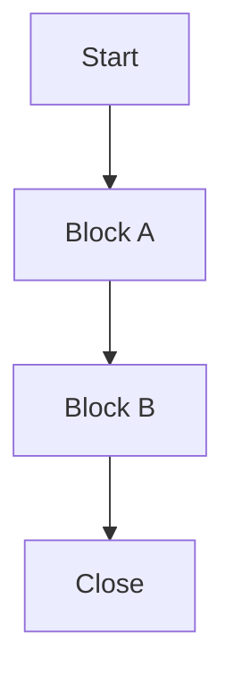
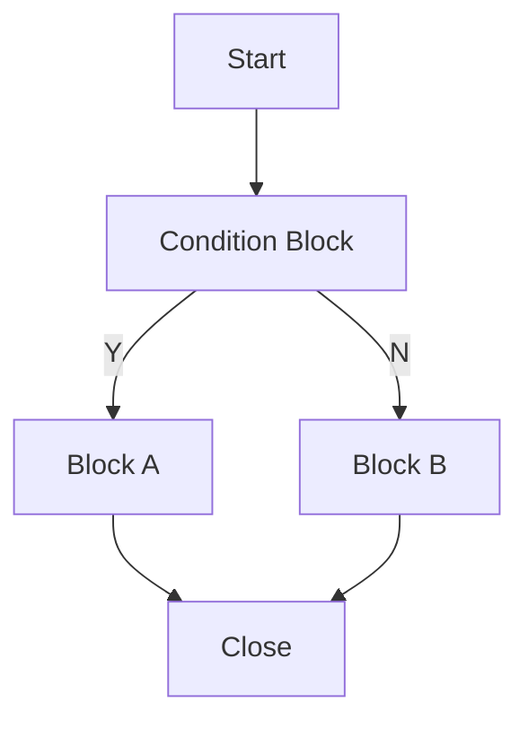
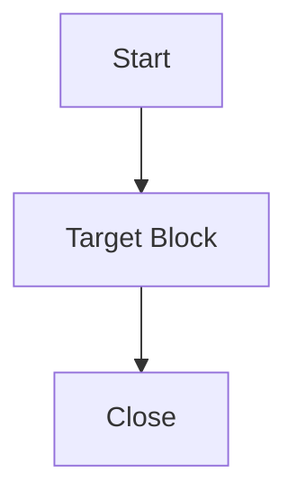
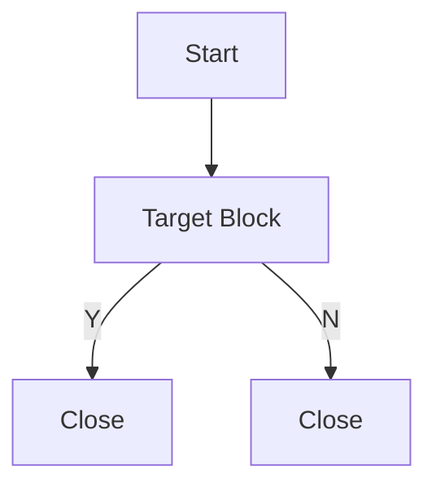
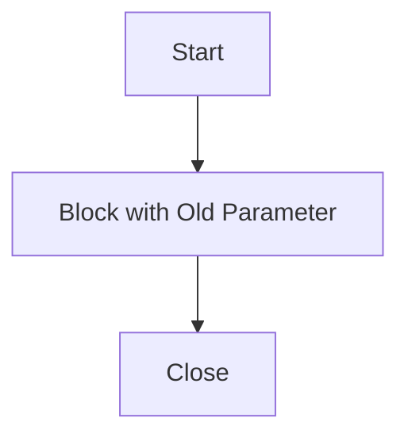

# Regression Test Strategy

## Summary

Regression Test 的目的：

> **確保系統修改後，在實際環境中，原有功能不壞，新功能可用，既有 SOP / Block / 參數仍相容。**

建議採用循序漸進策略：

```text
Phase 1：Block Workflow Regression
          → 確保每個 Block 的基本能力穩定

Phase 2：Standard SOP Regression
          → 確保高頻 / 重要流程組合穩定

Phase 3：User SOP Regression
          → 確保真實 User SOP 相容
```

---

## Method 1：測所有方塊任意組合

理論上最完整，但實務上不可行。

用 n8n 比喻：

```text
不可能把所有 Node 的所有排列組合都建立成 Workflow，
並把每一種資料情境都跑過一次。
```

---

## Method 2：線上 SOP

最接近線上的方案，是把 **User 線上設定的 SOP 全部拿回來測試**，並且盡量涵蓋每一條 path。

### 價值

- 驗證既有 User SOP 是否仍可執行
- 驗證舊參數 / 舊設定是否相容
- 發現測試人員沒想到的流程組合

### 限制

- 只能覆蓋 User 已使用情境
- 不保證每個 Block / 重要參數 / Y/N path 都被測到
- 測試資料難產生
- 失敗時不好定位

### 結論

```text
適合驗證真實流程相容性
不適合作為第一階段唯一方案
```

---

## Method 3：測高頻 / 重要組合

挑選線上高頻或業務重要流程，建立 Standard Test SOP。





### 價值

- 比單一 Block 更接近實際流程
- 比完整 User SOP Replay 更可控
- 可優先保護高頻 / 高風險流程

### 限制

- 仍不可能覆蓋所有組合
- 需要統計資料或人工判斷重要性
- 可能漏掉低頻但高風險情境

### 結論

```text
適合作為第二階段
補常見流程與重要流程
```

---

## Method 4：Block Workflow Regression

第一階段最適合先做這個。

目標是針對每個 Block 建立可控 Test SOP，先確保基本能力穩定。

### Action 型 Block



### Y / N 型 Block



### 有依賴的 Block

如果 Block B 依賴 Block A 的輸出或狀態，就組成最小必要 SOP 一起測。


```text
低耦合 Block：
    測單一 Block 的重要情境

有依賴 Block：
    組成最小必要 SOP 一起測
```

### 歷史 SOP 舊參數

如果知道舊參數格式，可直接建立 Test SOP 塞入舊參數。



### 驗證重點

- Block 是否能被 Workflow Engine 執行
- 重要參數組合是否正常
- Action / Y / N 判斷是否正確
- 每條 path 是否能走到 Close
- DB / Log / Output / UI 是否符合預期
- 有依賴的 Block 資料傳遞是否正確

### 限制

- 不一定涵蓋 User 真實拉法  
  但因為 Block 結果只有 `Action / Y / N`，且彼此沒有資料依賴，所以只要每個 Block 的重要情境都測過，組合起來理論上也應該穩定。  
  User SOP 主要用來補真實使用相容性，可抓到沒測到的依賴元件。(實際上Block SOP也都會測過類似的元件)

- 不一定涵蓋所有線上特殊組合  
  可透過盤點線上高頻 / 高風險 / 特殊 SOP 組合來補強。

- 需要先分析 Block 是否有依賴關係  
  可透過盤點 Block 輸入來源、輸出結果、DB 狀態變更與前後 Block 關係來補強。

  ```text
  低耦合：Start → Block → Close
  有依賴：Start → Block A → Block B → Close
  ```

### 結論

```text
最適合作為第一階段
可控、可定位、可覆蓋
```

---

## 最終建議

```text
不要第一階段就直接做完整 User SOP Replay。

先做：
Block + 重要參數 + Action / Y / N + Close

再補：
高頻 / 重要流程
User SOP Replay
```

> **User SOP Replay 很重要，但主要驗證真實流程相容性；  
> 要確保系統基本能力穩定，應先做 Block Workflow Regression。**
