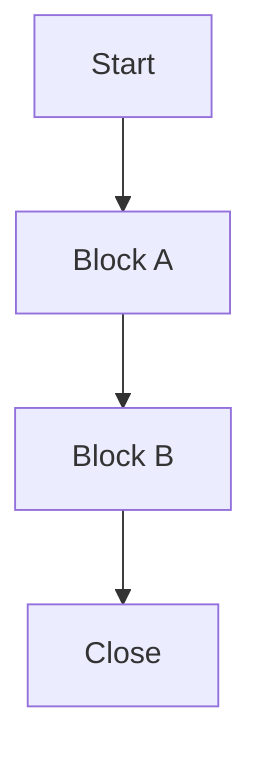
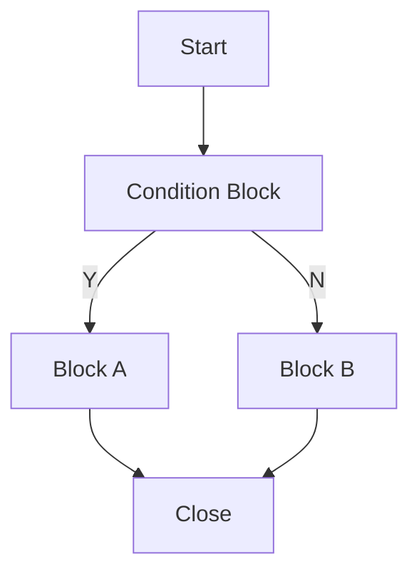
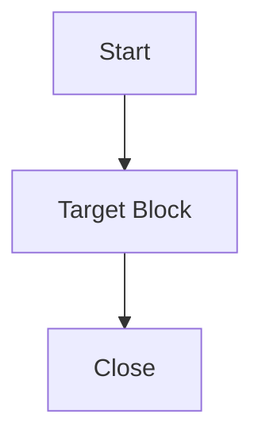
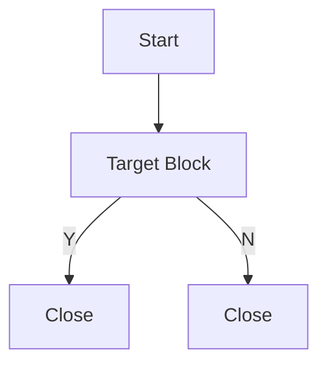
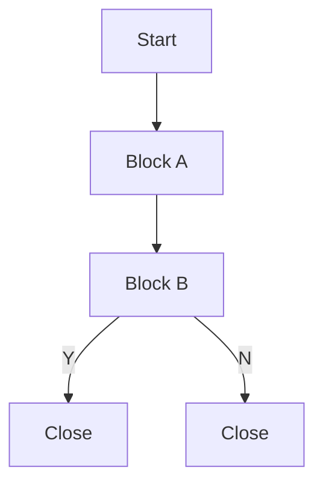
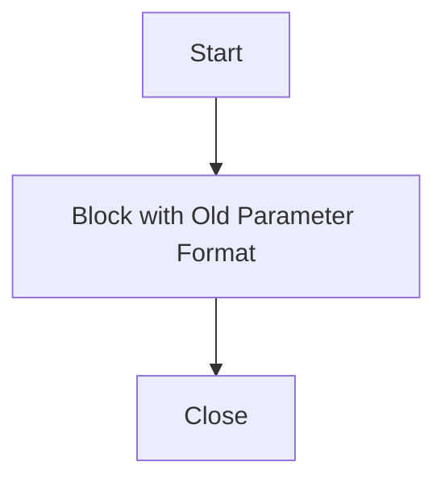

# Regression Test Strategy

## Summary

Regression Test 的目的：

> **確保系統修改後，在實際環境中，原有功能不壞，新功能可用，既有 SOP / Block / 參數仍相容。**

建議採用循序漸進策略：

```text
Phase 1：Block Workflow Regression
          → 確保每個 Block 的基本能力穩定

Phase 2：Standard SOP Regression
          → 確保高頻 / 重要流程組合穩定

Phase 3：User SOP Regression
          → 確保真實 User SOP 相容
```

Regression Test 可以分成四種思路：

```text
Method 1：測所有方塊任意組合
Method 2：Replay User 線上 SOP
Method 3：測高頻 / 重要組合
Method 4：測每個 Block 的重要情境
```

建議不要一開始就追求完整 User SOP Replay，而是先確保每個 Block 的基本能力穩定，再逐步補上常見流程與真實 User SOP。

---

## Method 1：測所有方塊任意組合

Regression Test 的完美狀態，是把 **所有方塊的任意組合都跑過一次**。

但方塊組合接近無限，實務上不可能完整測完。

用 n8n 來比喻，就是不可能把所有 Node 的所有排列組合都建立成 Workflow，並把每一種資料情境都跑過一次。

### 結論

```text
理論上最完整
實務上不可行
```

---

## Method 2：線上 SOP

最接近線上的方案，是把 **User 線上設定的 SOP 全部拿回來測試**，並且盡量涵蓋每一條 path。

### 優點

- 最接近線上真實流程
- 可驗證既有 User SOP 是否仍可執行
- 可驗證舊參數 / 舊設定是否相容
- 可發現開發或測試人員沒想到的流程組合

### 限制

User SOP Replay **不能單獨確保整個系統穩定**，因為它只覆蓋 User 已經建立過、使用過的情境。

它無法保證：

- 每個 Block 都有被測到
- 每個重要參數組合都有被測到
- 每條 Y / N / Exception path 都有被測到
- User 沒用過的情境不會壞

而且完整 User SOP Replay 雖然可以花時間建立，但成本較高：

- 測試資料難產生
- 線上情境不好模擬
- 外部系統 / 即時資料 / 歷史資料難控制
- 每一條 path 都跑到的成本很高
- 失敗時不好定位問題

### 結論

```text
真實性最高
但不適合作為第一階段唯一方案
```

---

## Method 3：測高頻 / 重要組合

統計線上出現最多的 Block 組合，或挑選業務上最重要的幾種組合，建立 Standard Test SOP。

例如：



或常見分支流程：



### 優點

- 比單一 Block 更接近實際流程
- 比完整 User SOP Replay 更可控
- 可優先保護高頻 / 高風險流程
- 適合建立固定 Regression Set

### 缺點

- 仍不可能覆蓋所有組合
- 需要統計資料或人工判斷重要性
- 可能漏掉低頻但高風險情境

### 結論

```text
適合作為第二階段
用來補常見流程與重要流程
```

---

## Method 4：Block Workflow Regression

第一階段更適合先做 **Block Workflow Regression**。

也就是針對每個 Block 建立可控的 Test SOP。

---

### Action 型 Block



---

### Y / N 型 Block



或拆成獨立 Case：

```text
Case 1：Start → Target Block → Y → Close
Case 2：Start → Target Block → N → Close
```

---

### 如果 Block 之間有依賴

如果 Block B 的輸入依賴 Block A 的輸出，或 Block B 必須接在 Block A 後面才有意義，則應該把有依賴關係的 Block 組成最小必要 SOP 一起測。


如果有分支：



原則：

```text
低耦合 Block：
    測單一 Block 的重要情境

有依賴 Block：
    組成最小必要 SOP 一起測
```

---

### 歷史 SOP 舊參數

如果知道舊參數格式，可以直接建立 Test SOP 塞入舊參數。



這樣可以更精準驗證：

- 舊參數是否仍可解析
- 舊設定是否相容
- 新版是否破壞 backward compatibility

---

### 驗證重點

- 每個 Block 都能被 Workflow Engine 執行
- 每個 Block 的重要參數組合都有被測到
- Y / N 判斷正確
- 每條 path 都能走到 Close
- DB / Log / Output / UI 顯示符合預期
- 有依賴的 Block 資料傳遞正確

### 優點

- 測試資料可控
- 失敗容易定位
- 可覆蓋每個 Block
- 可主動設計重要參數組合
- 可測 User 沒用過的情境
- 可針對有依賴性的 Block 組合做精準測試
- 適合自動化與長期維護

### 限制

- 不一定涵蓋 User 真實拉法  
  但因為 Block 結果只有 `Action / Y / N`，且彼此沒有資料依賴，所以只要每個 Block 的重要情境都測過，組合起來理論上也應該穩定。  
  User SOP 主要用來補真實使用相容性，可抓到沒測到的依賴元件。(實際上Block SOP也都會測過類似的元件)

- 不一定涵蓋所有線上特殊組合  
  可透過盤點線上高頻 / 高風險 / 特殊 SOP 組合來補強。

- 需要先分析 Block 是否有依賴關係  
  可透過盤點 Block 輸入來源、輸出結果、DB 狀態變更與前後 Block 關係來補強。

  ```text
  低耦合：Start → Block → Close
  有依賴：Start → Block A → Block B → Close
  ```

### 結論

```text
最適合作為第一階段
先確保系統基本能力穩定
```

---

## 建議導入順序

```text
Phase 1：Block Workflow Regression
          → 確保每個 Block 的基本能力穩定

Phase 2：Standard SOP Regression
          → 確保高頻 / 重要流程組合穩定

Phase 3：User SOP Replay Regression
          → 確保真實 User SOP 相容
```

---

## 一句話

> **User SOP Replay 很重要，但它主要驗證真實流程相容性；  
> 要確保系統基本能力穩定，第一階段更適合先測每個 Block 的重要情境，  
> 有依賴的 Block 則組成最小必要 SOP 一起測，  
> 最後再逐步補高頻流程與 User SOP Replay。**
